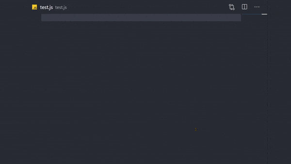
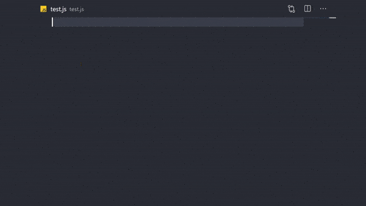
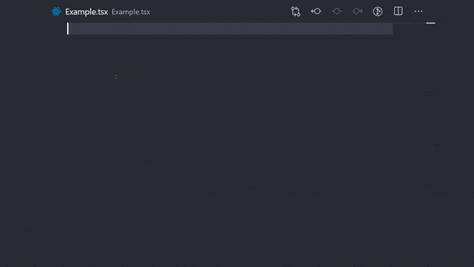

# Improve your developer experience with VSCode snippets

Code snippets are templates that make it easier to enter repeating code patterns. VSCode's snippets are just one big part of my coding experience. They make it super easy to get away with some boilerplate code. There are code snippet extensions for every language.
[You can find VSCode snippets for your language](https://marketplace.visualstudio.com/search?target=VSCode&category=Snippets&sortBy=Installs)

## Table of Content

1. Why create custom code snippets
2. How to create custom code snippets
3. Snippet Syntax
   - Tabstops
   - Placeholders
   - Variables

## Why I created custom snippets

Using [React](https://reactjs.org) for a long while, I've been using [an extension](https://marketplace.visualstudio.com/items?itemName=dsznajder.es7-react-js-snippets) for my snippets. It was great until I started using [NextJS](https://nextjs.org). [NextJS](https://nextjs.org) doesn't require `import React from "react"` at the top of every react file so it was felt a bit annoying to remove that line every time I used the snippet to start a file.

React 17 was released and we didn't need `import React from "react"` anymore so the extension became a bit obsolete to me 😑.

I needed more snippets too. I needed snippets for `typescriptreact` and custom hooks 😏.

## How to create custom snippets

It's easier than I thought. Almost too easy 🤗. I recommend checking out the [full guide in the VSCode docs](https://code.visualstudio.com/docs/editor/userdefinedsnippets).

To create or edit your own snippets,

- Go to **File** > **Preferences** > **User Snippets** ( **Code** > **Preferences** > **User Snippets** on macOS)
- Select the language for which the snippet should appear (in my case it's **typescriptreact**) or the **New Global Snippets** file option if they should appear for all languages.

Snippets files are written in JSON, support C-style comments and can define an unlimited number of snippets.

Below is an example of a for loop snippet for JavaScript:

```json
// in file 'Code/User/snippets/javascript.json'
{
  "For Loop": {
    "prefix": ["for", "for-const"],
    "body": ["for (const ${2:element} of ${1:array}) {", "\t$0", "}"],
    "description": "A for loop."
  }
}
```

In the example above:

- "For Loop" is the snippet name. It is displayed via IntelliSense if no `description` is provided.
- `prefix` defines one or more trigger words that display the snippet in IntelliSense. Substring matching is performed on prefixes, so in this case, "fc" could match "for-const".
- `body` is one or more lines of content, which will be joined as multiple lines upon insertion. Newlines and embedded tabs will be formatted according to the context in which the snippet is inserted.
- `description` is an optional description of the snippet displayed by IntelliSense.

## Snippet Syntax

The body of a snippet can use special constructs to control cursors and the text being inserted. The following are supported features and their syntaxes:

### Tabstops

With tabstops, you can make the editor cursor move inside a snippet. Use `$1`, `$2` to specify cursor locations. The number is the order in which tabstops will be visited, whereas `$0` denotes the final cursor position.

From the example above we can produce the result in this gif


As you can see in the gif, the cursor starts from `array`, then onto `element`, and then finally inside the curly brackets

### Placeholders

Placeholders are tapstops with values, like `${1:array}` from the above example. The number in `${1:array}` is the tapstop and the string after the colon is the default value.



### Variables

Variables are written as `$variable_name` or `${variable_name:default}`. When a variable isn't set, its default or the empty string is inserted.

Variables played a significant role in my snippets. I'd like you [read more on variables](https://code.visualstudio.com/docs/editor/userdefinedsnippets#_variables) yourself.

I only used one variable (`TM_FILENAME_BASE`) in my snippets, however, I find the rest to be useful, just not in my use case.

This is an example from my custom snippets

```json
{
  "Base Component Template": {
    "prefix": "rtc",
    "body": [
      "const ${1:$TM_FILENAME_BASE} = () => {",
      "return <>",
      "\t$0",
      "</>",
      "}",
      "\nexport default ${1:$TM_FILENAME_BASE}"
    ],
    "description": "Base React component with no props, imports or types"
  }
}
```

From the body, `${1:$TM_FILENAME_BASE}` is the placeholder, the `1` is the tapstop and it indicates the start and the `$TM_FILENAME_BASE` is the variable for the filename.

Another example with typescript interface

```json
{
  "Component With Props": {
    "prefix": "rtcp",
    "body": [
      "interface I${1:$TM_FILENAME_BASE}Props {",
      "\t$2",
      "}",
      "\nconst ${1:$TM_FILENAME_BASE}:React.FC<I${1:$TM_FILENAME_BASE}Props> = ({$3}) => {",
      "return <>",
      "\t$0",
      "</>",
      "}",
      "\nexport default ${1:$TM_FILENAME_BASE}"
    ],
    "description": "React component with props and interface definition templates"
  }
}
```

And with this, I have



See [more examples](https://github.com/Dchole/custom-snippets/blob/master/my-custom-snippet.json) in my [git repo](https://github.com/Dchole/custom-snippets)

## Conclusion

I'll like to clarify that, the snippet you're looking for probably exists in an extension but it's a great experience to create your own custom snippet 😊
